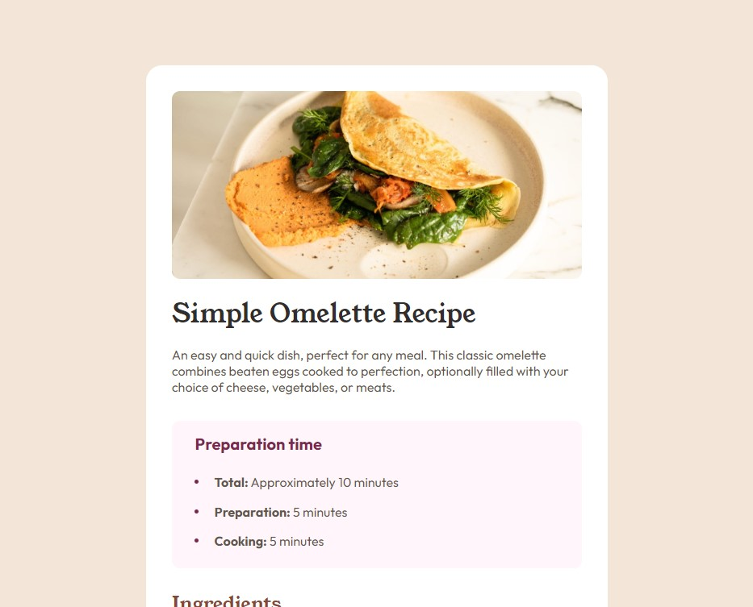

# Frontend Mentor - Recipe page solution

This is a solution to the [Recipe page challenge on Frontend Mentor](https://www.frontendmentor.io/challenges/recipe-page-KiTsR8QQKm). Frontend Mentor challenges help you improve your coding skills by building realistic projects.

## Table of contents

- [Overview](#overview)
  - [The challenge](#the-challenge)
  - [Screenshot](#screenshot)
  - [Links](#links)
- [My process](#my-process)
  - [Built with](#built-with)
  - [What I learned](#what-i-learned)
  - [Useful resources](#useful-resources)
- [Author](#author)
- [Acknowledgments](#acknowledgments)

**Note: Delete this note and update the table of contents based on what sections you keep.**

## Overview

### Screenshot

### Links

- Solution URL: [Click here to my GitHub repo](https://github.com/Jani-B/FEM-recipe-page-main)
- Live Site URL: [Click here to my Live page](https://jani-b.github.io/FEM-recipe-page-main/)

## My process

### Built with

- Semantic HTML5 markup
- CSS custom properties
- CSS Grid
- Mobile-first workflow

### What I learned

As i did this as mobile first I learned how to get everything fixed in the midlle of the screen after looking with normal screen (over 800px)
The last section (nutritions) I did with Display Grid as it seemed to work the best for this one.

## Author

- Frontend Mentor - [@Jani-B](https://www.frontendmentor.io/profile/Jani-B)
